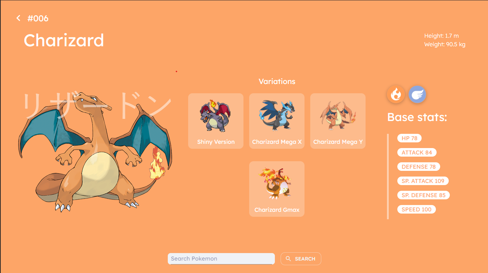

# Pokedex

## About

Pokedex developed with ReactJS.

Site: [https://pokedex-nine-zeta.vercel.app/](https://pokedex.empthy.dev/)
 
 

## Features

- Search Pokemons.
- Theme Swicther.
- All Pokemon Info.

 

 
 

# Tech Stack

- Typescript
- ReactJS
- Material UI (MUI)
- React Router
- PokeAPI

 

### Author

Nathan Stabille

https://www.linkedin.com/in/nathan-stabille

https://empthy.dev
